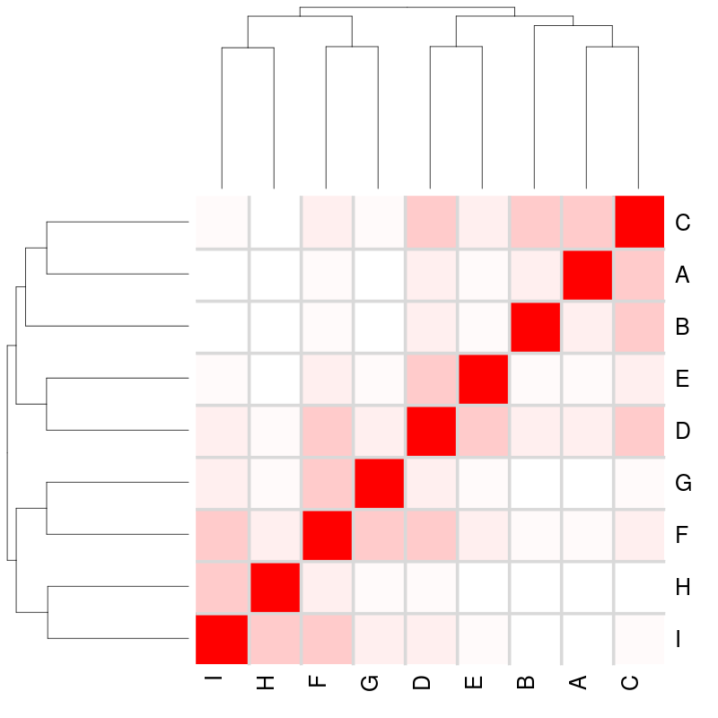
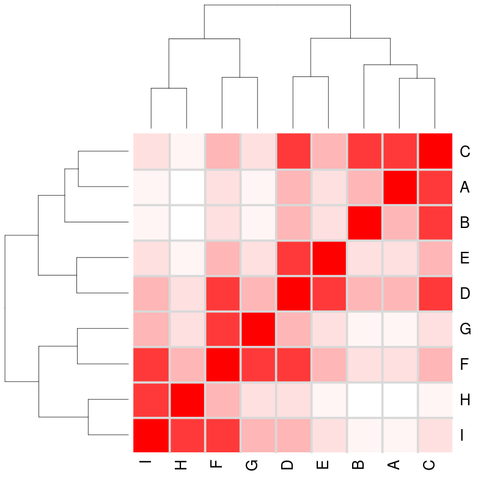
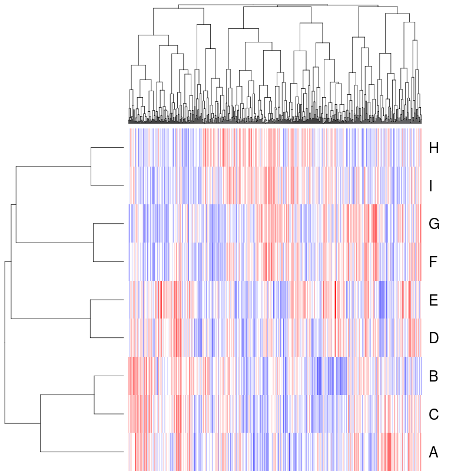
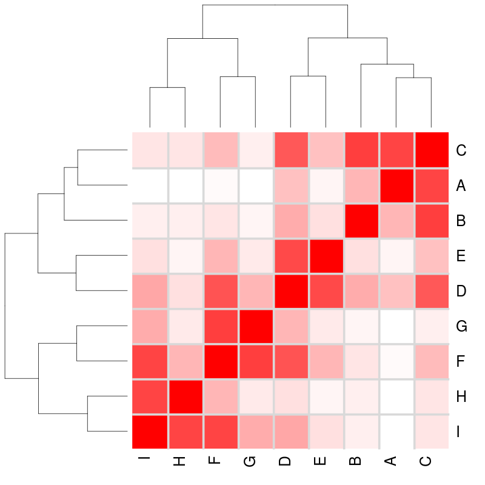
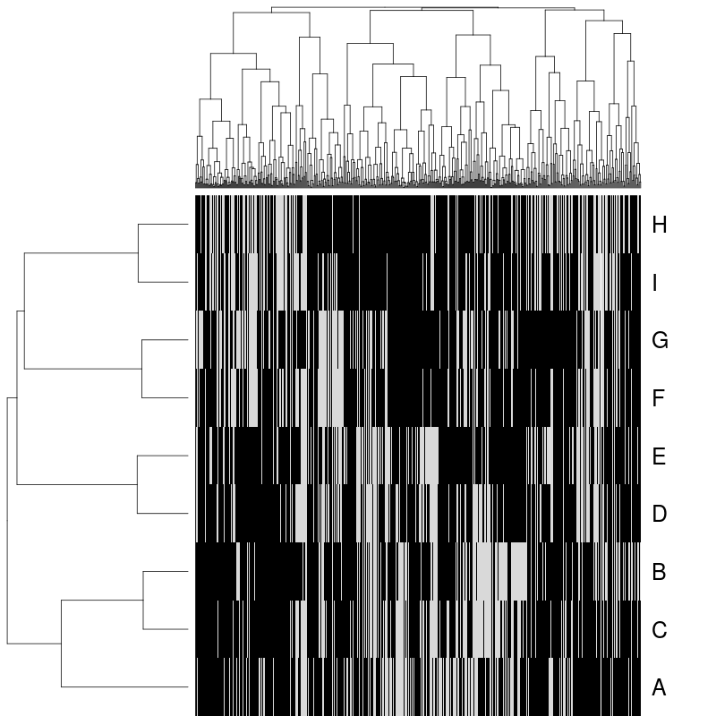
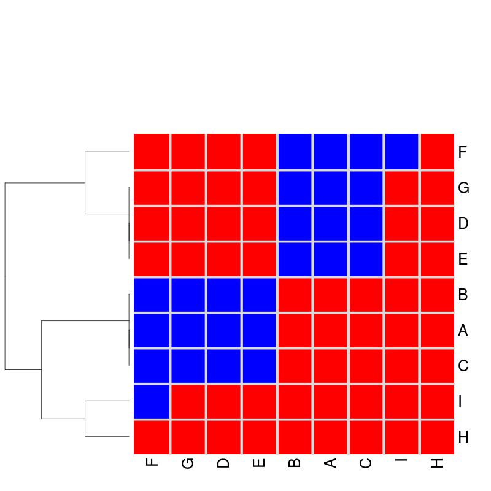
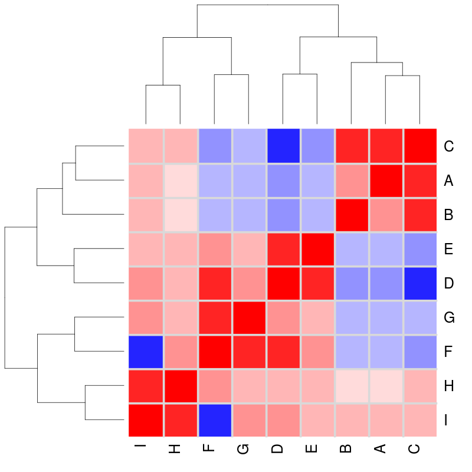
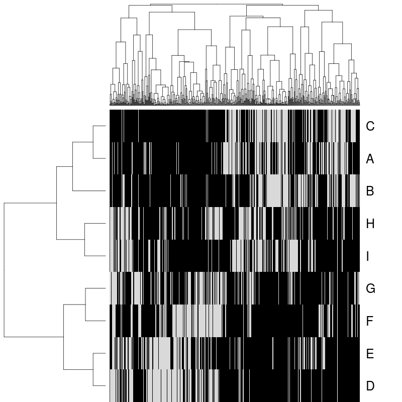

### Statement of Need

Provides a flexible framework to simulate biological pathways from a graph structure based on a statistical model of gene expression.

### Summary
Transcriptomic analysis is used to capture the molecular state of a cell
or sample in many biological and medical applications. In addition to 
identifying alterations in activity at the level of individual genes, 
understanding changes in the gene networks that regulate fundamental
biological mechanisms is also an important objective of molecular 
analysis. As a result, databases that describe biological pathways 
are increasingly relied on to assist with the interpretation of results
from large-scale genomics studies. Incorporating information from 
biological pathways and gene regulatory networks into a genomic data
analysis is a popular strategy, and there are many methods that provide
this functionality for gene expression data. When developing or comparing
such methods, it is important to gain an accurate assessment of their 
performance, with simulation-based validation studies a popular choice.
This necessitates the use of simulated data that correctly accounts for
pathway relationships and correlations. Here we present a versatile
statistical framework to simulate correlated gene expression data from
biological pathways, by sampling from a multivariate normal distribution
derived from a graph structure. This procedure has been released as the
`graphsim` R} package (\url{https://github.com/TomKellyGenetics/graphsim})
 and is compatible with any graph structure that can be described using
the `igraph` package.

Introduction: inference and modelling of biological networks {#sec:intro}
============================================================

Network analysis of molecular biological pathways has the potential to
lead to new insights into biology and medical genetics
[@Barabasi2004; @Hu2016]. Since gene expression profiles capture a
consistent signature of the regulatory state of a cell
[@Perou2000; @Ozsolak2011; @Svensson2018], they can be used to analyse
complex molecular states with genome-scale data. However, biological
pathways are often analysed in a reductionist paradigm as amorphous sets
of genes involved in particular functions, despite the fact that the
relationships defined by pathway structure could further inform gene
expression analyses. In many cases, the pathway relationships are
well-defined, experimentally-validated, and are available in public
databases [@Reactome]. As a result, network analysis techniques could
play an important role in furthering our understanding of biological
pathways and aiding in the interpretation of genomics studies.

Gene networks provide insights into how cells are regulated, by mapping
regulatory interactions between target genes and transcription factors,
enhancers, and sites of epigenetic marks or chromatin structures
[@Barabasi2004; @Yamaguchi2007]. Inference of these regulatory
interactions for genomics investigations has the potential to radically
expand the range of candidate biological pathways to be further
explored, or to improve the accuracy of bioinformatics and functional
genomic analysis. A number of methods have already been developed to
utilise timecourse gene expression data [@Arner2015; @Yamaguchi2007]
using gene regulatory modules in state-space models and recursive vector
autoregressive models [@Hirose2008; @Shimamura2009]. Various approaches
to gene regulation and networks at the genome-wide scale have lead to
novel biological insights [@Arner2015; @Komatsu2013]. However, inference
of regulatory networks has thus far relied on experimental validation or
resampling-based approaches to estimate the likelihood of specific
network modules being predicted [@Markowetz2007; @Hawe2019].

There is a need, therefore, for a systematic framework for statistical
modelling and simulation of gene expression data derived from
hypothetical, inferred or known gene networks. Here we present an
package to achieve this, where samples from a multivariate normal
distribution are used to generate normally-distributed log-expression
data, with correlations between genes derived from the structure of the
underlying pathway or gene regulatory network. This methodology enables
simulation of expression profiles that approximate the log-transformed
and normalised data from microarray and bulk or single-cell RNA-Seq
experiments. This procedure has been released as the package to enable
the generation of simulated gene expression datasets containing pathway
relationships from a known underlying network. These simulated datasets
can be used to evaluate various bioinformatics methodologies, including
statistical and network inference procedures.

Methodology and software {#sec:methods}
========================

Here we present a procedure to simulate gene expression data with
correlation structure derived from a known graph structure. This
procedure assumes that transcriptomic data have been generated and
follow a log-normal distribution (i.e.,
$log(X_{ij}) \sim MVN({\bf\mu}, \Sigma)$, where ${\bf\mu}$ and $\Sigma$
are the mean vector and variance-covariance matrix respectively, for
gene expression data derived from a biological pathway) after
appropriate normalisation [@Law2014; @Li2015]. Log-normality of gene
expression matches the assumptions of the popular package, which is
often used for the analysis of intensity-based data from gene expression
microarray studies and count-based data from RNA-Seq experiments. This
approach has also been applied for modelling UMI-based count data from
single-cell RNA-Seq experiments in the package [@Wang2018].

In order to simulate transcriptomic data, a pathway is first constructed
as a graph structure, using the package [@igraph], with the status of
the edge relationships defined (i.e, whether they activate or inhibit
downstream pathway members). [This procedure uses]{style="color: black"}
a graph structure such as that presented in
Figure [\[fig:simple\_graph:first\]](#fig:simple_graph:first){reference-type="ref"
reference="fig:simple_graph:first"}. The graph can be defined by an
adjacency matrix, **$A$** (with elements
[$A_{ij}$]), where 
$A_{ij} = 
\begin{cases}
   $1$                         & if genes i and j are adjacent \\
   $0$                         & otherwise
\end{cases}$
A matrix, **$R$**, with elements
[$R_{ij}$]{style="color: black"}, is calculated based on distance (i.e.,
number of edges contained in the shortest path) between nodes, such that
closer nodes are given more weight than more distant nodes, to define
inter-node relationships. A geometrically-decreasing (relative) distance
weighting is used to achieve this: [ $$R_{ij} = 
\begin{cases}
   1                            & if genes $i$ and $j$ are adjacent \\
   (\frac{1}{2})^{d_{ij}}      & if a path can be found  between genes $i$ and $j$ \\
   0                            & if no path exists between genes $i$ and $j$ 
\end{cases}$$]{style="color: black"} where $d_{ij}$ is the length of
the shortest path (i.e., minimum number of edges traversed) between
genes (nodes) $i$ and $j$ in graph $G$. Each more distant node is thus
related by $\frac{1}{2}$ compared to the next nearest, as shown in
Figure [\[fig:simulation\_activating:second\]](#fig:simulation_activating:second){reference-type="ref"
reference="fig:simulation_activating:second"}. An
arithmetically-decreasing (absolute) distance weighting is also
supported in the package which implements this procedure: [ $$R_{ij} = 
\begin{cases}
   1                            & if genes $i$ and $j$ are adjacent \\
   1-\frac{d_{ij}}{diam(G)}     & if a path can be found  between genes $i$ and $j$ \\
   0                            & if no path exists between genes $i$ and $j$ 
\end{cases}$$ ]{style="color: black"}

Assuming a unit variance for each gene, these values can be used to
derive a $\Sigma$ matrix: $$\Sigma_{ij} = 
\begin{cases}
   1                            & if $i=j$ \\
   \rho R_{ij}  & otherwise
\end{cases}$$ where $\rho$ is the correlation between adjacent nodes.
Thus covariances between adjacent nodes are assigned by a correlation
parameter ($\rho$) and the remaining off-diagonal values in the matrix
are based on scaling these correlations by the geometrically weighted
relationship matrix (or the nearest positive definite matrix for
$\Sigma$ with negative correlations).\
Computing the nearest positive definite matrix is necessary to ensure
that the variance-covariance matrix could be inverted when used as a
parameter in multivariate normal simulations, particularly when negative
correlations are included for inhibitions (as shown below). Matrices
that could not be inverted occurred rarely with biologically plausible
graph structures but this approach allows for the computation of a
plausible correlation matrix when the graph structure given is
incomplete or contains loops. When required, the nearest positive
definite matrix is computed using the `nearPD` function of the package
[@Matrix] to perform Higham's algorithm [@Higham2002] on
variance-covariance matrices. The package gives a warning when this
occurs.

Illustrations {#sec:illustrations}
=============

Generating a Graph Structure {#sec:plot_graph}
----------------------------

The graph structure in
Figure [\[fig:simple_graph:first\]](#fig:simple_graph:first){reference-type="ref"
reference="fig:simple_graph:first"} was used to simulate correlated gene
expression data by sampling from a multivariate normal distribution
using the package [@Genz2009; @mvtnorm]. The graph structure
visualisation in
Figure [\[fig:simple_graph\]](#fig:simple_graph){reference-type="ref"
reference="fig:simple_graph"} was specifically developed for (directed)
iGraph objects in and is available in the and packages. The
`plot_directed` function enables customisation of plot parameters for
each node or edge, and mixed (directed) edge types for indicating
activation or inhibition. These inhibition links (which occur frequently
in biological pathways) are demonstrated in
Figure [\[fig:simple\_graph:second\]](#fig:simple_graph:second){reference-type="ref"
reference="fig:simple_graph:second"}.

A graph structure can be generated and plotted using the following
commands in R:

\#install packages required (once per machine)
install.packages(\"igraph\") install.packages(\"devtools\")
library(\"devtools\")
devtools::install\_github(\"TomKellyGenetics/graphsim\") \#install
custom plotting package
devtools::install\_github(\"TomKellyGenetics/plot.igraph\")

\#load required packages (once per R instance) library(\"igraph\")
library(\"graphsim\") library(\"plot.igraph\")

\#generate graph structure graph\_edges \<- rbind(c(\"A\", \"C\"),
c(\"B\", \"C\"), c(\"C\", \"D\"), c(\"D\", \"E\"), c(\"D\", \"F\"),
c(\"F\", \"G\"), c(\"F\", \"I\"), c(\"H\", \"I\")) graph \<-
graph.edgelist(graph\_edges, directed = T)

\#plot graph structure (Figure 1) plot\_directed(graph, state =
\"activating\", layout = layout.kamada.kawai, cex.node=3, cex.arrow=5,
arrow\_clip = 0.2)

\#generate parameters for inhibitions state \<- c(1, 1, -1, 1, 1, 1, 1,
-1, 1)

\#plot graph structure with inhibitions (Figure 2) plot\_directed(graph,
state=state, layout = layout.kamada.kawai, cex.node=3, cex.arrow=5,
arrow\_clip = 0.2)

Generating a Simulated Expression Dataset {#sec:graphsim_demo}
-----------------------------------------

[\[fig:simulation_activating\]]{#fig:simulation_activating
label="fig:simulation_activating"}

The correlation parameter of $\rho = 0.8$ is used to demonstrate the
inter-correlated datasets using a geometrically-generated relationship
matrix (as used for the example in
Figure [\[fig:simulation_activating:third\]](#fig:simulation_activating:third){reference-type="ref"
reference="fig:simulation_activating:third"}). This $\Sigma$ matrix was
then used to sample from a multivariate normal distribution such that
each gene had a mean of $0$, standard deviation $1$, and covariance
within the range $[0,1]$ so that the off-diagonal elements of $\Sigma$
represent correlations. This procedure generated a simulated (continuous
normally-distributed) log-expression profile for each node
(Figure [\[fig:simulation_activating:fourth\]](#fig:simulation_activating:fourth){reference-type="ref"
reference="fig:simulation_activating:fourth"}) with a corresponding
correlation structure
(Figure [\[fig:simulation_activating:fifth\]](#fig:simulation_activating:fifth){reference-type="ref"
reference="fig:simulation_activating:fifth"}). The simulated correlation
structure closely resembled the expected correlation structure ($\Sigma$
in
Figure [\[fig:simulation_activating:third\]](#fig:simulation_activating:third){reference-type="ref"
reference="fig:simulation_activating:third"}) even for the relatively
modest sample size ($N=100$) illustrated in
Figure [\[fig:simulation_activating\]](#fig:simulation_activating){reference-type="ref"
reference="fig:simulation_activating"}. Once a gene expression dataset
comprising multiple pathways has been generated (as in
Figure [\[fig:simulation_activating:fourth\]](#fig:simulation_activating:fourth){reference-type="ref"
reference="fig:simulation_activating:fourth"}), it can then be used to
test procedures designed for analysis of empirical gene expression data
(such as those generated by microarrays or RNA-Seq) that have been
normalised on a log-scale.

The simulated dataset can be generated using the following code:

\#adjacency matrix adj\_mat \<- make\_adjmatrix\_graph(graph)

\#relationship matrix dist\_mat \<- make\_distance\_graph(graph\_test4,
absolute = F)

\#sigma matrix directly from graph sigma\_mat \<-
make\_sigma\_mat\_dist\_graph(graph, 0.8, absolute = F)

\#show shortest paths of graph shortest\_paths \<- shortest.paths(graph)

\#generate expression data directly from graph expr \<-
generate\_expression(100, graph, cor = 0.8, mean = 0, comm = F, dist =
T, absolute = F, state = state)

\#\#plot steps

\#plot adjacency matrix heatmap.2(make\_adjmatrix\_graph(graph), scale =
\"none\", trace = \"none\", col = colorpanel(3, \"grey75\", \"white\",
\"blue\"), colsep = 1:length(V(graph)), rowsep = 1:length(V(graph)))

\#plot relationship matrix heatmap.2(make\_distance\_graph(graph\_test4,
absolute = F), scale = \"none\", trace = \"none\", col = bluered(50),
colsep = 1:length(V(graph)), rowsep = 1:length(V(graph)))

\#plot sigma matrix heatmap.2(make\_sigma\_mat\_dist\_graph(graph, 0.8,
absolute = F), scale = \"none\", trace = \"none\", col = bluered(50),
colsep = 1:length(V(graph)), rowsep = 1:length(V(graph))) expr \<-
generate\_expression(100, graph, cor = 0.8, mean = 0, comm = F, dist =
T, absolute = F, state = state)

\#plot simulated expression data heatmap.2(expr, scale = \"none\", trace
= \"none\", col = bluered(50), colsep = 1:length(V(graph)), rowsep =
1:length(V(graph)))

\#plot simulated correlations heatmap.2(cor(t(expr)), scale = \"none\",
trace = \"none\", col = bluered(50), colsep = 1:length(V(graph)), rowsep
= 1:length(V(graph)))

[\[fig:simulation_inhibiting\]]{#fig:simulation_inhibiting
label="fig:simulation_inhibiting"}

The simulation procedure
(Figure [\[fig:simulation_activating\]](#fig:simulation_activating){reference-type="ref"
reference="fig:simulation_activating"}) can similarly be used for
pathways containing inhibitory links
(Figure [\[fig:simulation_inhibiting\]](#fig:simulation_inhibiting){reference-type="ref"
reference="fig:simulation_inhibiting"}) with several refinements. With
the inhibitory links
(Figure [\[fig:simulation_inhibiting:first\]](#fig:simulation_inhibiting:first){reference-type="ref"
reference="fig:simulation_inhibiting:first"}), distances are calculated
in the same manner as before
(Figure [\[fig:simulation_inhibiting:second\]](#fig:simulation_inhibiting:second){reference-type="ref"
reference="fig:simulation_inhibiting:second"}) with inhibitions
accounted for by iteratively multiplying downstream nodes by $-1$ to
form modules with negative correlations between them
(Figures [\[fig:simulation_inhibiting:third\]](#fig:simulation_inhibiting:third){reference-type="ref"
reference="fig:simulation_inhibiting:third"}
and [\[fig:simulation_inhibiting:fifth\]](#fig:simulation_inhibiting:fifth){reference-type="ref"
reference="fig:simulation_inhibiting:fifth"}). A multivariate normal
distribution with these negative correlations can be sampled to generate
simulated data
(Figure [\[fig:simulation_inhibiting:fourth\]](#fig:simulation_inhibiting:fourth){reference-type="ref"
reference="fig:simulation_inhibiting:fourth"}).

[\[fig:simulation_smad\]]{#fig:simulation_smad
label="fig:simulation_smad"}

The simulation procedure is also demonstrated here
(Figure [\[fig:simulation_smad\]](#fig:simulation_smad){reference-type="ref"
reference="fig:simulation_smad"}) on a pathway structure for a known
biological pathway (from reactome R-HSA-2173789) of TGF-$\beta$ receptor
signaling activates SMADs
(Figure [\[fig:simulation_smad:first\]](#fig:simulation_smad:first){reference-type="ref"
reference="fig:simulation_smad:first"}) derived from the Reactome
database version 52 `[@Reactome]`. Distances are calculated in the same
manner as before
(Figure [\[fig:simulation_smad:second\]](#fig:simulation_smad:second){reference-type="ref"
reference="fig:simulation_smad:second"}) producing blocks of correlated
genes
(Figures [\[fig:simulation_inhibiting:third\]](#fig:simulation_inhibiting:third){reference-type="ref"
reference="fig:simulation_inhibiting:third"}
and [\[fig:simulation_inhibiting:fifth\]](#fig:simulation_inhibiting:fifth){reference-type="ref"
reference="fig:simulation_inhibiting:fifth"}). This shows that
multivariate normal distribution can be sampled to generate simulated
data to represent expression with the complexity of a biological pathway
(Figure [\[fig:simulation_inhibiting:fourth\]](#fig:simulation_inhibiting:fourth){reference-type="ref"
reference="fig:simulation_inhibiting:fourth"}). Here *SMAD7* exhibits
negative correlations with the other SMADs consistent with it's
functions as as an "inhibitor SMAD" with competitively inhibits *SMAD4*.

These simulated datasets could then be used for simulating synthetic
lethal partners of a query gene within a graph network. The query gene
was assumed to be separate from the graph network pathway and was added
to the dataset using the procedure in
Section [\[methods:simulating_SL\]](#methods:simulating_SL){reference-type="ref"
reference="methods:simulating_SL"}. Thus I can simulate known synthetic
lethal partner genes within a synthetic lethal partner pathway
structure.

 
 

 
 
 

Summary and discussion {#sec:summary}
======================

Biological pathways are of fundamental importance to understanding
molecular biology. In order to translate findings from genomics studies
into real-world applications such as improved healthcare, the roles of
genes must be studied in the context of molecular pathways. Here we
present a statistical framework to simulate gene expression from
biological pathways, and provide the package in to generate these
simulated datasets. This approach is versatile and can be fine-tuned for
modelling existing biological pathways or for testing whether
constructed pathways can be detected by other means. In particular,
methods to infer biological pathways and gene regulatory networks from
gene expression data can be tested on simulated datasets using this
framework. The package also enables simulation of complex gene
expression datasets to test how these pathways impact on statistical
analysis of gene expression data using existing methods or novel
statistical methods being developed for gene expression data analysis.

Computational details {#computational-details .unnumbered .unnumbered}
=====================

The results in this paper were obtained using  3.6.1 with the  1.2.4.1
 1.2-17,  1.0-3, and  1.0-11 packages. itself and all dependent packages
used are available from the Comprehensive Archive Network (CRAN) at
\url{https://CRAN.R-project.org}. The and packages presented can be
installed from <https://github.com/TomKellyGenetics/graphsim> and
\url{https://github.com/TomKellyGenetics/plot.igraph} respectively. These
functions can also be installed using the library at
\url{https://github.com/TomKellyGenetics/igraph.extensions} which includes
other plotting functions used. This software is cross-platform and
compatible with installations on Windows, Mac, and Linux operating
systems. The package GitHub repository also contains Vignettes with more
information and examples on running functions released in the package.
The package ( 0.1.0) meets CRAN submission criteria and will be
released.

Acknowledgements {#acknowledgements .unnumbered .unnumbered}
================

This package was developed as part of a PhD research project funded by
the Postgraduate Tassell Scholarship in Cancer Research Scholarship
awarded to STK. We thank members of the Laboratory of Professor Satoru
Miyano at the University of Tokyo, Institute for Medical Science,
Professor Seiya Imoto, Associate Professor Rui Yamaguchi, and Dr Paul
Sheridan (Assistant Professor at Hirosaki University,CSO at Tupac Bio)
for helpful discussions in this field. We also thank Professor Parry
Guilford at the University of Otago, Professor Cristin Print at the
University of Auckland, and Dr Erik Arner at the RIKEN Center for
Integrative Medical Sciences for their excellent advice during this
project.

# References
