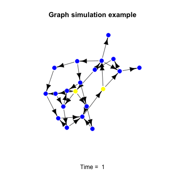
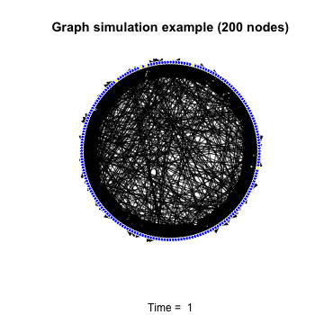

R's igraph package provides a simple and flexible set of utilities for working with graphs.  In this post, we'll use this package to animate the simulated spread of a disease through a network.

##Graphs

A graph is just a collection of nodes joined by edges:

```{r, message = F}
library("igraph")
# Specify an undirected graph by hand, using a numeric
# vector of the pairs of vertices sharing an edge.
G <- graph( c(1,2,1,3,1,4,3,4,3,5,5,6,6,7,7,8,8,9,3,8,5,8), directed = FALSE )
```

## Visualization
```{r}
plot(G, layout = layout.fruchterman.reingold,
vertex.size = 25,
vertex.color="red",
vertex.frame.color= "white",
vertex.label.color = "white",
vertex.label.family = "sans",
edge.width=2,
edge.color="black")
```

In graph models, the nodes of a graph typically represent entities and the edges represent relationships between these entities. Both nodes and edges may have attributes or qualities that characterize the entities and the relationships. A node might have an attribute of "color". An edge might have an attribute of "weight" that encodes the strength of the relationship between the vertices that the edge joins. The igraph package makes it very simple to manage the assignment of attributes to the components of a graph:

```{r}
G <- graph( c(1,2,1,3,1,4,3,4,3,5,5,6,6,7,7,8,8,9,3,8,5,8), directed = FALSE )

# Assign attributes to the graph
G$name    <- "A colorful example graph"

# Assign attributes to the graph's vertices
V(G)$name  <- toupper(letters[1:9])
V(G)$color <- sample(rainbow(9),9,replace=FALSE)

# Assign attributes to the edges
E(G)$weight <- runif(length(E(G)),.5,4)

# Plot the graph -- details in the "Drawing graphs" section of the igraph manual
plot(G, layout = layout.fruchterman.reingold,
     main = G$name,
     vertex.label = V(G)$name,
     vertex.size = 25,
     vertex.color= V(G)$color,
     vertex.frame.color= "white",
     vertex.label.color = "white",
     vertex.label.family = "sans",
     edge.width=E(G)$weight,
     edge.color="black")
```

##Building a simulation

The ease and flexibility with which you can assign and update attributes of a graph's nodes and edges makes igraph a powerful tool for prototyping simulations with graphs. Let's consider a very simplified example. Let G be a graph whose nodes are people in a population. Two nodes in G will share an edge if they have daily in-person contact with each other. Suppose also that a virus has infected a few nodes of G. These infected nodes can spread the virus to other uninfected nodes with whom they have daily contact. Newly infected nodes will then spread the virus to other nodes, and so on. Let's use the simple probability model:

`p(x infects y|x is infected,y is uninfected,x and y share an edge)=12`.

Here is a function that implements this simulation model:

```{r}
spreadVirus <- function(G,Vinitial,p){
  # Precompute all outgoing graph adjacencies
  G$AdjList = get.adjlist(G,mode="out")

  # Initialize various graph attributes
  V(G)$color    = "blue"
  E(G)$color    = "black"
  V(G)[Vinitial]$color    <- "yellow"

  # List to store the incremental graphs (for plotting later)
  Glist <- list(G)
  count <- 1

  # Spread the infection
  active <- Vinitial
  while(length(active)>0){
    new_infected <- NULL
    E(G)$color = "black"
    for(v in active){
      # spread through the daily contacts of vertex v
      daily_contacts <- G$AdjList[[v]]
      E(G)[v %->% daily_contacts]$color <- "red"
      for(v1 in daily_contacts){
        new_color <- sample(c("red","blue"), 1 ,prob=c(p,1-p))
        if(V(G)[v1]$color == "blue" & new_color=="red"){
          V(G)[v1]$color <- "red"
          new_infected <- c(new_infected,v1)
          }
        }
      }
    # the next active set
    active <- new_infected

    # Add graph to list
    count <- count + 1
    Glist[[count]] <- G
    }
    return(Glist)
}
```

The function spreadVirus will return an ordered list of graphs representing the discrete states of the model as the virus spreads. We'll demonstrate the use of this function on a simple directed graph. A directed graph is a graph where edges are "one-way", so a directed edge from nodes X to Y only allows information to pass from X to Y and not from Y to X.

```{r, message = F, warnings =F}
# Specify a directed graph by hand
G <- graph.formula(1-+2,1-+3,2-+4,2-+5,3-+6,5-+7,7-+8,8-+9,9+-7, 9-+10,
                   6-+9,1-+5,5-+20,3-+9,10-+11,10-+15,11-+12,11-+13,13-+14, 14-+15,
                   15-+11,4-+8,15-+16,15-+17,17-+18,18-+4,17-+19,19-+20,
                   20-+1,14-+1,19-+3)
Vinitial <- c("1","10")

# Run the simulation
set.seed(55555)
Glist <- spreadVirus(G,Vinitial,1/2)

# Animation plots (generates a .GIF)
library("animation")
L <- layout.fruchterman.reingold(Glist[[1]])
ani.options(interval=1)
saveGIF({
  count =0
  for(i in 1:length(Glist)){
    plot(Glist[[i]], layout = L,
         vertex.label = NA,
         vertex.size = 10,
         vertex.color= V(G)$color,
         vertex.frame.color= "white",
         edge.arrow.size = 1,
         edge.color=E(G)$color)
    count = count +1
    title(main="Graph simulation example",
          sub=paste("Time = ",count), cex.main = 1.2, cex.sub = 1)
  }
}, interval = 1, movie.name = "demo.gif", ani.width = 350, ani.height = 350)
```



This is a very simplistic model and it does not, for example, take into account the importance of time dynamic effects in the virus spread. Thanks to the flexibility of igraph, however, it is not difficult to extend a basic simulation like spreadVirus to include much more complex effects.

We should note, however, that although this implementation is very easy to understand, it is not very efficient. The heavy use of loops will be quite slow when we start working with large graphs. Though we might gain some efficiency through vectorization or other optimizations, for running larger simulations we would probably want to port this routine to another platform like C++. Nevertheless, the strength of R's igraph for quickly building and testing a prototype should be apparent from this example.

##More realistic graphs

So far, the graphs we have worked with have been quite simple. How do we start building more complex graphs? There are many great sources for real graph data like Stanford's SNAP dataset collection. There are also many routines for generating random graphs in the igraph packages. The degree.sequence.game method in igraph is one such example. The degree of a node in a graph is the number of edges attached to that node. One way to study graphs is to look at the distribution of the degrees of the nodes in the graph. For many interesting graphs, the degree distribution often has the form of an exponential distribution:

`p(degree(node)=N)∝exp(−τN)`

See for example this Wikipedia article which discusses the degree distribution of all web links. As suggested in the igraph manual, we can generate a larger random graph with an exponential distribution as follows:

```{r}
N <- 200
in.deg  <- sample(1:N, N, replace = TRUE, prob = exp(-.5*1:N))
G <-degree.sequence.game(in.deg=in.deg,out.deg=in.deg,method="simple.no.multiple")
```

Here's an example simulation on this new graph:

```{r}
# set seed for reproducible example
set.seed(2014)

# build graph list
Vinitial   = sample(V(G),5,replace=FALSE)
Glist <- spreadVirus(G,Vinitial,1/2)

# Circle layout is better for large graphs
L = layout.circle(Glist[[1]])

# Animation
ani.options(interval=1)
saveGIF({
count =0
for(i in 1:length(Glist)){
plot(Glist[[i]], layout = L,
vertex.label = NA,
vertex.size = 4,
vertex.color= V(G)$color,
vertex.frame.color= "white",
edge.arrow.size = 1,
edge.color=E(G)$color)
count = count +1
title(main="Graph simulation example (200 nodes)",
sub=paste("Time = ",count), cex.main = 1.2, cex.sub = 1)
}
}, interval = 1, movie.name = "demo2.gif", ani.width = 350, ani.height = 350)
```




###Sources

Adapted from the following posts:

* http://blog.ryanwalker.us/2014/03/going-viral-with-rs-igraph-package.html

* https://www.r-bloggers.com/going-viral-with-rs-igraph-package/
